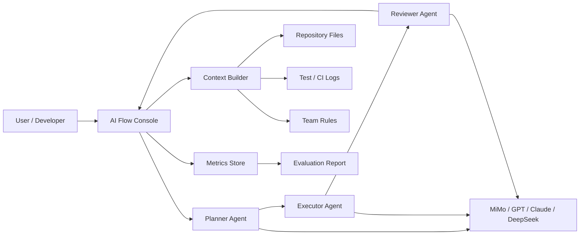

# AI Flow Pilot

AI Flow Pilot 是一个面向长上下文模型的多 Agent 工作流编排与评估原型项目。项目目标是把「需求拆解、代码理解、任务执行、质量评审、结果复盘」串成可观测的自动化流程，用于验证 Xiaomi MiMo 系列模型在 Agent / Coding 场景中的长上下文能力、稳定性和成本效率。

> 当前阶段：项目处于空壳原型阶段，已完成产品定位、技术方案、页面骨架和申请材料整理。README 中涉及人数、Token 消耗、效率提升的数据均提供为可替换模板，提交申请时请替换成真实数据。

## 项目定位

AI Flow Pilot 不是一个单轮 Chat 工具，而是一个面向研发团队的「AI 工作流控制台」。它重点解决三个问题：

1. 长代码仓库上下文难以持续传递：通过任务级上下文包，把仓库结构、需求、变更 diff、测试日志和历史结论组织成可复用上下文。
2. Agent 输出质量不稳定：通过 Planner、Executor、Reviewer 三段式流程，把计划、执行和审查分离，减少单次生成偏差。
3. 模型成本和效果难以评估：记录每次任务的 Token 消耗、耗时、通过率和人工修正次数，为不同模型选择提供依据。

## 为什么适合 MiMo

Xiaomi MiMo-V2.5-Pro 支持 Agent / Coding 场景，并具备 100 万 Token 上下文能力。AI Flow Pilot 会优先验证以下能力：

- 大仓库上下文读取：把项目目录、关键源码、测试结果和产品需求一次性纳入推理上下文。
- 多轮任务规划：让 Planner 根据完整上下文拆分任务，减少执行阶段反复补充信息。
- 自动代码审查：Reviewer 针对 diff、测试结果和规范文档生成可执行的审查结论。
- 长链路自反馈：Executor 根据 Reviewer 的反馈进行二次修正，并保留可追踪记录。
- 成本评估：对比 MiMo、GPT、Claude、DeepSeek 等模型在同一任务上的 Token 消耗和通过率。

## 核心场景

### 1. 自动化代码审查 Agent

流程：

1. 读取 PR diff、相关源码、测试日志和项目规范。
2. Planner 识别风险点并生成审查路径。
3. Reviewer 输出按严重程度排序的问题、影响范围和建议修复方式。
4. 系统记录审查结果、人工采纳情况和误报情况。

预期效果：

- 降低重复性 review 成本。
- 提升边界条件、异常状态和测试缺口的发现率。
- 为团队沉淀可复用的审查规范。

### 2. 需求到任务拆解

流程：

1. 输入产品需求、现有模块说明和技术约束。
2. Planner 生成开发任务、依赖关系、风险点和验收条件。
3. Reviewer 检查任务是否过大、是否缺少边界条件、是否遗漏测试。

预期效果：

- 把模糊需求转成可执行的工程任务。
- 减少需求评审阶段的遗漏。
- 为后续自动实现或半自动实现提供结构化输入。

### 3. 文档与知识库维护

流程：

1. 读取代码变更和 commit 信息。
2. Executor 自动生成 README、接口说明、变更日志和迁移说明草稿。
3. Reviewer 检查文档是否与代码行为一致。

预期效果：

- 保持文档与代码同步。
- 降低新成员理解项目的成本。
- 支持按模块生成知识库条目。

## 技术架构



模块说明：

- `AI Flow Console`：前端控制台，展示任务、Agent 状态、模型配置和评估数据。
- `Context Builder`：上下文构建模块，负责收集源码、diff、日志和规范。
- `Planner Agent`：任务规划 Agent，负责目标拆解、风险识别和执行路径生成。
- `Executor Agent`：执行 Agent，负责生成代码、文档或结构化输出。
- `Reviewer Agent`：审查 Agent，负责质量评估、边界检查和修正建议。
- `Metrics Store`：评估数据记录层，后续可接入 SQLite、PostgreSQL 或云端存储。

## 当前项目结构

```text
ai-flow/
├── docs/
│   ├── application-material.md
│   └── roadmap.md
├── src/
│   ├── App.tsx
│   ├── data/
│   │   └── project.ts
│   ├── main.tsx
│   ├── styles.css
│   └── types.ts
├── .env.example
├── .gitignore
├── index.html
├── package.json
├── tsconfig.json
└── vite.config.ts
```

## 快速开始

环境要求：

- Node.js 20+
- npm 10+

安装依赖：

```bash
npm install
```

本地启动：

```bash
npm run dev
```

构建：

```bash
npm run build
```

代码检查：

```bash
npm run typecheck
```

## MiMo API 配置

复制环境变量示例：

```bash
cp .env.example .env.local
```

配置 API Key：

```bash
VITE_MIMO_API_KEY=your_api_key_here
VITE_MIMO_BASE_URL=https://token-plan-cn.xiaomimimo.com/v1
VITE_MIMO_MODEL=mimo-v2.5-pro
```

说明：

- Token Plan 建议使用 `https://token-plan-cn.xiaomimimo.com/v1`。
- 普通余额可使用 `https://api.xiaomimimo.com/v1`。
- 前端直连 API 只适合本地原型验证。正式环境应通过后端代理隐藏 API Key。

## 申请 MiMo Token Plan 时的项目描述模板

下面内容可用于申请表「项目描述」字段。提交前请把方括号内容替换成真实信息，不要直接提交未替换模板。

```text
我正在构建 AI Flow Pilot，一个面向研发团队的多 Agent 工作流编排与评估系统，核心场景是自动化代码审查、需求拆解、文档生成和模型效果评估。

项目采用 Planner / Executor / Reviewer 三段式 Agent 流程：Planner 负责读取需求、代码仓库结构、PR diff 和测试日志，生成任务拆解与风险清单；Executor 根据计划生成代码或文档草稿；Reviewer 结合团队规范、测试结果和上下文，对输出进行质量审查并给出修正建议。

MiMo-V2.5-Pro 的 100 万 Token 上下文非常适合该项目，因为代码审查和仓库理解需要一次性处理大量源码、规范文档、历史变更和 CI 日志。我们计划重点验证 MiMo 在长上下文代码理解、多轮自反馈、低成本批量审查和 Agent 执行稳定性上的表现。

当前项目已完成前端控制台原型、技术方案和评估指标设计，计划接入 Codex / Cursor / OpenCode 等日常开发工具。[团队人数] 人会参与试用，预计每日处理 [PR 数量] 个代码变更任务，预估日均 Token 消耗约 [Token 数量]。目标是在 30 天内完成 [任务数量] 次 Agent 任务评估，并将代码审查耗时降低 [百分比]，文档生成效率提升 [倍数]。

项目地址：[GitHub 链接]
```

如果目前没有团队数据，可以使用更保守的版本：

```text
我正在构建 AI Flow Pilot，一个面向个人开发者和小团队的多 Agent 工作流编排与评估原型，核心场景是自动化代码审查、需求拆解、文档生成和模型效果评估。

项目采用 Planner / Executor / Reviewer 三段式 Agent 流程，把仓库结构、关键源码、PR diff、测试日志和团队规范统一组织成长上下文任务包。Planner 负责生成任务计划，Executor 负责产出代码或文档草稿，Reviewer 负责检查边界条件、测试缺口和规范一致性。

MiMo-V2.5-Pro 的 100 万 Token 上下文能力非常适合该项目，能够支持更完整的仓库级代码理解和长链路 Agent 自反馈。当前项目已完成控制台原型、架构设计和评估指标设计，计划在 30 天内完成代码审查、需求拆解、文档生成三类任务的对比评测，并记录 MiMo 与 GPT、Claude、DeepSeek 等模型在 Token 成本、任务通过率和人工修正次数上的差异。

项目地址：[GitHub 链接]
```

## 使用证明建议

申请表「使用证明与影响力证明」可以提交以下材料：

- GitHub 仓库链接：建议包含 README、项目结构、路线图和本地运行方式。
- 控制台截图：启动本项目后截图首页，展示 Agent 流程、指标和 MiMo 接入计划。
- 评估计划文档：提交 `docs/application-material.md` 或 `docs/roadmap.md` 的截图。
- Demo 视频：录制 1 到 2 分钟，展示任务创建、Agent 状态和指标面板。

## 评估指标

| 指标 | 说明 |
| --- | --- |
| Task Success Rate | Agent 任务一次通过率 |
| Review Precision | 代码审查问题被人工采纳的比例 |
| Token Cost / Task | 单个任务的平均 Token 消耗 |
| Latency / Task | 单个任务从创建到完成的耗时 |
| Human Fix Count | 每个任务需要人工修正的次数 |
| Context Coverage | 上下文包覆盖的源码、日志和规范比例 |

## 路线图

详细路线图见 [docs/roadmap.md](docs/roadmap.md)。

短期计划：

- 完成 MiMo API 调用代理。
- 支持上传 PR diff 和项目规范。
- 实现 Planner / Executor / Reviewer 的任务状态流转。
- 增加模型对比评估表。
- 输出可提交的任务评估报告。

## 许可证

MIT
